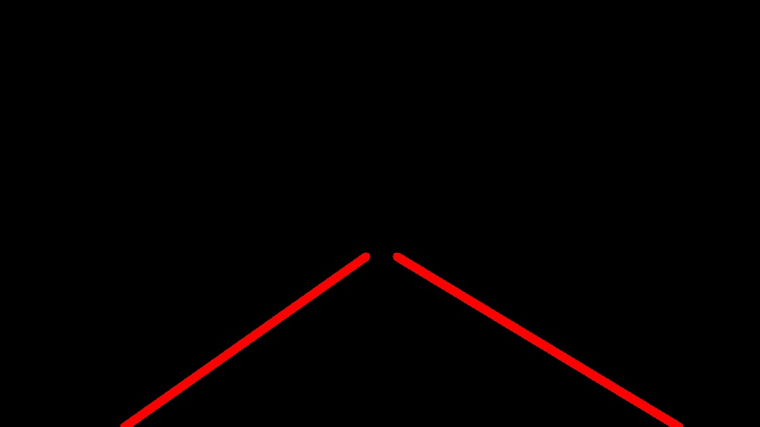

# **Finding Lane Lines on the Road** 

---

The goals / steps of this project are the following:
* Make a pipeline that finds lane lines on the road
* Reflect on your work in a written report

---

## Reflection

## 1. Pipeline:
### My pipeline consists of following steps. ###
1. Convert the RGB image to HSL image. (to accomodate for the reflection and dark areas)
    - I also tried HSV, HSL had better results.
2. Select only the yellow and white hue from the image.

3. Convert the image into greyscale.

4. Apply gaussian blur.

5. Select the region of image where the lanes are likely to be.

6. Apply Canny edge detection.

7. Apply Probabilistic Hough Line transformation & extrapolate average slope and intercepts.

8. Overlap this image with the original image

### In order to draw a single line on the left and right lanes, I modified the draw_lines() as below ###
1. I obtained the slope and the intercept of each of the lines after Hough transformation.
2. If the slope is negative, I considered it to be left lane otherwise it is the right lane.
3. I also calculate the length of the detected lane, which act as weights/importance of the line.
4. A weighted average of slope and intercept is calculated per frame/image per lane.
5. A (slope, intercept) tuple is obtained for both right and left lane.
6. This is used to extrapolate the line segment from the bottom of the image to the middle of the image.
7. This image is overlaped with the original image to mark the lanes.

## 2. Identify potential shortcomings with your current pipeline

* Curved lanes are not easy to fit, as we use line segments to draw the lanes.
* The line segments in the video are very jerky. Line segment from the previous frame doesn't blend into the next frame.

## 3. Suggest possible improvements to your pipeline

* Use a quadratic or higher order equation to model the lanes, so that curved lanes can also be fit properly.
* Remember the lane history of previous frames to render a smooth lane detection in the video.
    - May be a decaying weighted average of the historical frames or slopes & intercept. Oldest frame has the least weight and the latest the maximum weight.
